# Browser Agent v86 - Architecture

> **English** | [Español](ARCHITECTURE.es.md)

The application is a **TypeScript + ESM + esbuild** frontend served from `public/`. The browser loads `public/index.html`, a minimal set of globally loaded vendor libraries, and the main `public/assets/app.js` bundle as a module. That bundle imports the AI SDK ESM bridge on demand.

The VM runs **v86** and Alpine x86. The LLM layer uses **AI SDK v7** and **Browser AI v3** with Transformers.js and Ollama backends. Agent tools execute inside the VM through a serial channel separate from the visible console.

The immutable HDA root, HDB/IndexedDB workspace and verifiable snapshots are detailed in [VM storage and snapshots](STORAGE_AND_SNAPSHOTS.en.md).

## Overview



<details>
<summary>Mermaid source for regenerating the image</summary>

```text
---
config:
  layout: elk
  elk:
    nodePlacementStrategy: BRANDES_KOEPF
    considerModelOrder: NODES_AND_EDGES
---
flowchart LR
  subgraph Browser["Browser"]
    direction TB
    UI["UI<br/>public/index.html + app.js"]
    Chat["💬 LLM chat"]
    Xterm["⌨️ xterm.js<br/>up to 4 tabs"]
    AiSdk["AI SDK v7<br/>bridge + ai-sdk-browser.mjs"]
    Worker["Transformers.js worker"]
    V86["🖥️ v86 emulator"]

    subgraph VM["🐧 Alpine x86 VM"]
      direction TB
      S1["ba-serial1-runner<br/>tools/checks"]
      S2["ba-serial2-console-runner<br/>xterm/PTY daemon"]
      PTY["PTYs for tabs 2-4<br/>/bin/sh, nano, top..."]
      Tools["Alpine commands"]
    end
  end

  subgraph Local["🏠 Optional local services"]
    direction TB
    Ollama["🦙 Ollama<br/>127.0.0.1:11434"]
    Wsnic["wsnic<br/>127.0.0.1:8086"]
  end

  UI --> Chat
  UI --> Xterm
  UI -->|"boot · snapshots · storage"| V86

  Chat --> AiSdk
  AiSdk -->|"transformersjs"| Worker
  AiSdk --> Ollama
  AiSdk -->|"serial1 / ttyS1<br/>agent tools"| V86

  Xterm <-->|"serial0 / ttyS0<br/>boot console"| V86
  Xterm <-->|"serial2 / ttyS2<br/>base64 frames"| V86

  V86 -->|"serial1 / ttyS1"| S1
  S1 --> Tools
  V86 -->|"serial2 / ttyS2"| S2
  S2 <-->|"openpty/select"| PTY

  V86 <-->|"optional WS networking"| Wsnic
```

</details>

## Served root

`public/` is the only HTTP root. Editable HTML/CSS lives outside it and is regenerated with `pnpm build`:

- `src/web/index.html`: source template for the UI shell.
- `src/web/styles/style.css`: source CSS entry point; imports `src/web/styles/*.css`.
- `public/index.html`: generated shell with cache hashes.
- `public/style.css` and `public/styles/`: CSS generated/copied for development.
- `public/assets/app.css`: minified CSS bundle generated by `pnpm build:prod`.
- `public/assets/app.js`: main ESM bundle.
- `public/assets/ai-sdk-bridge.mjs`: generated ESM bridge dynamically imported by `app.js`.
- `public/assets/chat/`: generated AI SDK bundle and LLM worker.
- `public/vendor/`: libraries copied from npm.
- `public/v86/`: v86 runtime, BIOS, kernel, initramfs, profiles, and disks.
- `public/_headers`: headers for compatible static deployments.

`server.mjs` only serves `public/` and adds COOP/COEP/CORP, the `.wasm` MIME type, per-type caching, and `Range` support.

## Frontend build

`scripts/build/frontend.mjs` generates:

- `public/index.html`
- `public/style.css`
- `public/styles/`
- `public/assets/app.js`
- `public/assets/ai-sdk-bridge.mjs`
- `public/assets/app.css` when run with `--minify` or `BA_MINIFY=1`
- `public/locales/es.json` and `public/locales/en.json`

The `src/browser/main.ts` entry point initializes the application from ESM modules. `scripts/build/frontend.mjs` bundles that entry point with esbuild (`format: "esm"`).

Application runtime components must communicate through ESM imports, typed events, or domain APIs. Avoid exposing project-specific globals on `window`; any exception must be justified as an unavoidable technical boundary and documented.

## i18n

All UI copy lives in JSON catalogs (`src/web/locales/*.json`), and code only refers to keys through `t()`/`tn()` (`src/browser/app/i18n.ts`).

- Supported languages: `es` (base) and `en`.
- Selection: the language is stored in `localStorage` (`ba.lang`). If there is no saved value, the app chooses `es` when any browser language is Spanish and `en` otherwise. The header selector (`src/browser/app/lang-selector.ts`) switches languages instantly without reloading.
- Both catalogs are copied to `public/locales/`, but the runtime keeps only the active catalog in memory.
- `pnpm check` runs `scripts/check/i18n.mjs` to enforce key parity between `es.json` and `en.json`. Key parity does not validate text quality; new strings must be added to both catalogs.

## Application build

`scripts/build.mjs` runs, in order:

1. `scripts/build/llm-browser-bundles.mjs`
2. `scripts/build/frontend.mjs`

`pnpm build` assumes that `pnpm setup` has already prepared the base runtime assets that the generated HTML references with cache-busting hashes, such as xterm and the base Alpine profile.

LLM source and generated outputs:

- `src/browser/chat/models/`: runtime discovery, inspection, hardware dtype selection, and validation/defaults for the user's last selected configuration. The build contains no model inventory and does not query external model APIs.
- `public/assets/chat/ai-sdk-browser.mjs`, generated from `src/browser/chat/provider/ai-sdk/entry.ts`.
- `public/assets/chat/workers/llm-browser-ai.worker.mjs`, generated from `src/browser/chat/provider/ai-sdk/llm-browser-ai.worker.ts`.
- `public/assets/ai-sdk-bridge.mjs`, generated from `src/browser/chat/provider/ai-sdk-bridge.ts`.

The bridge imports the generated `assets/chat/ai-sdk-browser.mjs` bundle and exports an ESM API consumed by `src/browser/chat/provider/ai-sdk-runtime.ts`. It does not publish internal globals on `window`.

## Runtime assets

Runtime libraries must be declared in `package.json` and copied from `node_modules` by `scripts/setup/runtime-assets.mjs`:

| Dependency | Output |
| --- | --- |
| `v86` | `public/v86/build/libv86.js`, `public/v86/build/v86.wasm` |
| `@xterm/xterm` | `public/vendor/xterm/xterm.js`, `public/vendor/xterm/xterm.css` |
| `dompurify` | `public/vendor/llm/dompurify/purify.es.mjs` |
| `streaming-markdown` | `public/vendor/llm/streaming-markdown/smd.js` |

Within `scripts/setup/runtime-assets.mjs`, the only remote downloads are the v86 BIOS and Alpine minirootfs; runtime libraries come from npm. Profile generation separately downloads Alpine packages and the wordlists declared by each profile. Do not add new libraries directly to `public/vendor/`; declare them in npm and copy or bundle them from scripts.

## Code domains

`src/` separates executable code from static sources:

- `src/browser/`: frontend TypeScript that is compiled into JavaScript bundles.
- `src/web/`: source HTML template and CSS generated into `public/`.

Within `src/browser/`, TypeScript is organized by domain:

| Path | Responsibility |
| --- | --- |
| `src/browser/app/` | Global state, bootstrap, text helpers, and origin notices |
| `src/browser/vm/` | v86, profiles, assets, serial channels, network, disks, snapshots, and VM operations |
| `src/browser/console/` | xterm tabs, PTY sessions, close, and refresh |
| `src/browser/ui/` | Visual state, modals, checks, and tooltips |
| `src/browser/chat/state/` | LLM state, models, and capabilities |
| `src/browser/chat/panel/` | LLM panel, controls, and capability view |
| `src/browser/chat/runtime/` | Agent loop, chat UI, routing, artifacts, context, and resources |
| `src/browser/chat/tools/` | Tool registry, policies, and executor |
| `src/browser/chat/provider/` | AI SDK bridge, Ollama provider, Transformers.js worker, and tool-call parser/middleware |
| `src/browser/core/` | Shared events |

## Globals

The frontend does not publish its own API on `window`; internal modules communicate through ESM imports, typed events, or domain APIs.

Remaining technical boundaries:

- `window.V86Starter` / `window.V86`: v86 runtime loaded as a vendor.
- `window.Terminal`: xterm runtime loaded as a vendor.

New TypeScript modules must live in `src/browser/` and communicate through ESM imports, typed events, or domain APIs.

## Serial channels and VM execution

```txt
User / LLM
  -> execVm() [src/browser/vm/operations.ts]
    -> targetTools=true (default)
      -> backgroundToolsApi.execVm()
      -> serial1 / ttyS1
      -> ba-serial1-runner
    -> targetTools=false
      -> serial0 / ttyS0 with __BAGENT_* markers
```

Current contracts:

- `serial0` / `/dev/ttyS0`: boot, base login, and user tab 1.
- `serial1` / `/dev/ttyS1`: LLM tools, checks, the manual form, and internal operations that must not affect the visible console.
- `serial2` / `/dev/ttyS2`: xterm/PTY daemon. It multiplexes tabs 2-4 as real PTYs to xterm.js using base64 frames.
- There is no silent `serial1` to `serial0` fallback in `execVm(targetTools=true)`.
- Cancellation: the browser sends `__BA_S1_CANCEL:<id>` over `serial1` to abort the current job in `ba-serial1-runner` after a timeout, reset, or user cancellation.

Runner sources:

- `vm/overlay/common/usr/local/bin/ba-serial1-runner`
- `vm/overlay/common/usr/local/bin/ba-serial2-console-runner`

Both guest runners are written in Python 3 and run as persistent processes supervised by the guest init process included in the initramfs. Therefore, `python3` is a required dependency of every VM profile; `pnpm check` and `scripts/setup/vm-profile-image.mjs` enforce it.

## VM and images

`scripts/setup.mjs` runs:

1. `scripts/check/vm-profiles.mjs`
2. `scripts/setup/runtime-assets.mjs`
3. `scripts/setup/vm-profile-image.mjs vm/profiles/*.json` for each valid profile, ordered by filename

Profiles are discovered from `vm/profiles/*.json`, excluding `profile.schema.json`. If any profile fails schema validation, `setup` stops before generating images.

`scripts/setup/vm-profile-image.mjs` produces each profile manifest with `profileHash`, SHA-256 identities, a minimal initramfs, split ext4 HDA and HDB seed. The same `CowDisk` backs HDB in memory for temporary sessions or IndexedDB for the profile's persistent workspace.

### Storage and snapshots

The architecture separates three concepts so the UI does not depend on v86's internal cache:

```text
immutable profile HDA
  + in-memory CoW HDB                   -> temporary session
  + IndexedDB CoW HDB                   -> profile persistent workspace

v86 state + HDB delta + UI metadata     -> .bav86snapshot file
```

- `ResolvedVmRuntime` pins the profile, assets, RAM/VRAM, network, topology, and storage mode before boot or restore.
- A workspace is identified by `profileHash`; a different base produces another identity and never reuses incompatible data.
- `IndexedDbCowBlockStore` stores metadata and 64 KiB blocks by `workspaceId`, generation, and index. `CowDisk` uses the same contract with an in-memory store for temporary sessions.
- The UI reads metadata to add **💾** to a profile. For the active generation, `storedBytes()` walks records in a read-only transaction and totals their `byteLength`; this excludes Cache Storage, LLM models, and other profiles.
- **Reset workspace** requires three conditions: compatible data, persistent mode selected, and a stopped VM. `reset()` removes the workspace blocks and returns its metadata to the empty `main` generation.
- There is no separate portable workspace format. Export and import always operate on `.bav86snapshot`.

The snapshot container includes v86 state, the explicit HDB delta, and visual console state. Import validates the format, hashes, profile, and assets before stopping the current VM; it then reflects the recorded profile, RAM, VRAM, and mode in the UI. After applying state, it reconnects `serial1`/`serial2`, rebuilds tabs, preserves custom names and the active tab, and requests `Ctrl+L` to redraw every restored PTY.

The user-facing explanation is in the [User manual](USER_MANUAL.en.md#temporary-session-workspace-or-snapshot); the detailed contract is in [VM storage and snapshots](STORAGE_AND_SNAPSHOTS.en.md).

### How a VM profile is built and which files are involved

The flow goes from the profile JSON to the initramfs image served from `public/`:

```txt
vm/profiles/<id>.json                  (profile definition)
  -> scripts/check/vm-profiles.mjs     (validates against profile.schema.json)
  -> scripts/setup/vm-profile-image.mjs (profile orchestrator)
       -> build/profiles/<id>/firstboot.sh
       -> build/profiles/<id>/build-commands.sh
       -> bash scripts/setup/vm-alpine-overlay-hda.sh (via PROFILE_*/ALPINE_* env vars)
            -> scripts/setup/lib/common.sh           (require_build_tools, repos, metadata)
            -> scripts/setup/lib/profile-rootfs.sh   (packages via Docker, buildCommands, message)
                 -> scripts/setup/lib/docker-install-packages.sh (run inside the container)
            -> scripts/setup/lib/kernel-modules.sh   (linux-lts kernel + v86 modules)
            -> vm/overlay/common/init                (guest /init)
            -> vm/overlay/common/usr/local/bin/ba-serial1-runner, ba-serial2-console-runner
  -> public/v86/images/profiles/<id>-initramfs.gz, public/v86/images/kernels/alpine-<branch>-vmlinuz-lts   (outputs)
  -> public/v86/images/profiles/<id>.json + index.json          (manifests)
```

Files per step:

- Definition: `vm/profiles/<id>.json` (schema in `vm/profiles/profile.schema.json`; the filename must match the `id`).
- Profile orchestrator: `scripts/setup/vm-profile-image.mjs` reads the JSON, writes `firstboot.sh` and `build-commands.sh` into `build/profiles/<id>/`, and invokes the build passing `PROFILE_*` and `ALPINE_*`.
- Image build: `scripts/setup/vm-alpine-overlay-hda.sh` acts as an orchestrator and delegates to `scripts/setup/lib/*.sh`:
  - `common.sh`: host dependency checks, `/etc/apk/repositories`, and rootfs metadata (`browser-agent-build-id`, `-profile-name`, `-profile-id`).
  - `profile-rootfs.sh`: profile package installation via Docker export (with `docker-install-packages.sh` inside the container), `buildCommands` execution, and boot message.
  - `kernel-modules.sh`: downloads `linux-lts`, extracts the kernel, and resolves/copies the network and storage modules, generating `/etc/v86-net-modules.list`.
- Guest: the `/init` and serial runners are installed from the single source under `vm/overlay/common/` with `install -m 0755`.
- Outputs: minimal initramfs, split root HDA, HDB seed, shared kernel, and manifests under `public/v86/images/`.

Serial runners and the guest `/init` are installed from `vm/overlay/common/`. After changing the overlay, profiles, runners, build libraries, or Alpine build, run `pnpm setup`.

## LLM layer

Turn flow:

```txt
sendChat()
  -> llmAgent.handleUserMessage()
  -> resolveTurnModelConfig()
  -> buildAiSdkTools()
  -> getAiSdk().runAgentStreamTurn()
    -> streamText()
    -> stopWhen(isStepCount(maxSteps))
    -> prepareStep()
    -> toolApproval() / resume when required
  -> tool.execute()
  -> llmToolExecutor.runTool()
  -> execVm()
  -> serial1 / ba-serial1-runner
  -> artifacts + chat response
```

Important details:

- `prepareStep` hides tools through `activeTools: []` when the turn does not need the VM or when a later step must synthesize prose.
- In the first step with tools, `prepareStep` can restrict `activeTools` to the permitted subset.
- The runner uses the AI SDK loop (`streamText` + `stopWhen(isStepCount)`). When it receives `tool-approval-request`, it asks the UI and resumes with `responseMessages` plus one `tool-approval-response` message; those structured messages live only for the current turn.
- Native approval policy combines active tools, risk level, and autonomy. A denial never invokes `execute()`, creates no artifact, and does not reopen the modal for the same operation during the turn.
- Tool executions are serialized per turn to protect the `serial1` channel even when AI SDK presents several calls in parallel.
- The runner keeps a fallback synthesis when tools ran and the text response is missing, resembles a tool plan, or the SDK synthesis step fails.
- The Transformers.js middleware removes `toolChoice` for compatibility with that backend.
- A turn captures its effective configuration before the first `await`. `resolveTurnModelConfig()` combines the active runtime with the selected turn-safe settings; fields that require model recreation remain bound to the loaded runtime. The UI locks those fields during a response and unloads the runtime when they change while chat is idle, requiring a new load.
- Reasoning (thinking) is configured on the user's current selection. Transformers.js can extract a configurable tag with `extractReasoningMiddleware`; Ollama accepts a boolean or supported effort level and returns native `message.thinking`. It is streamed and is not retained in memory or as the final response.
- The latest selection and its LLM configuration are stored under `ba.llm.lastProfile.v1`; the Transformers.js file cache is independent of this preference.
- Ollama is called from the browser, not the VM. The default endpoint is `http://127.0.0.1:11434`.

### Tool and profile contract

The tool system is split between tool definitions, profile policy, and runtime execution.

- Tool definitions live in `src/browser/chat/tools/definitions/*.ts` and are discovered into the virtual `virtual:ba-tools` module; there is no hand-written tool index.
- VM profiles expose tools through `allowedTools`. That list is the policy source of truth for generated profiles, and its order is used as the default priority when the UI/model limits visible tools.
- `requiredPackages` links each tool to the Alpine packages it needs. `scripts/check/vm-profiles.mjs` validates unknown tools and missing packages; runtime also filters tools that the active profile cannot support.
- `runtimeChecks` declares the minimal commands that prove a tool is actually available in the VM. The **Run checks** panel gets them from the registry according to `allowedTools`; the profile package-installed check stays separate.
- Execution flows through native AI SDK approval when required by risk and, after approval, argument normalization, VM/serial preconditions, `buildCommand()`, `execVm(..., targetTools: true)` on `serial1`, result formatting, and artifact storage.
- If a tool needs a specific executable name, keep the profile build/validation commands, `runtimeChecks`, and tests aligned. For example, `web_nikto_quick` depends on Nikto plus Perl SSL packages but executes `nikto.pl` through `timeout`; `alpine-pentest-web` also exposes a `nikto` symlink for manual use.

Key files:

| File | Responsibility |
| --- | --- |
| `src/browser/chat/models/model-config.ts` | Decides which changes require a runtime reload and captures the effective configuration for each turn |
| `src/browser/chat/panel/` | Discovery, selection, controls, progress, errors, and LLM panel views |
| `src/browser/chat/provider/ai-sdk-bridge.ts` | Creates/loads models, WebGPU→WASM fallback, Ollama, and the AI SDK bridge ESM API |
| `src/browser/chat/provider/ai-sdk/browser-agent-runner.ts` | AI SDK turn, steps, streaming, and fallback synthesis |
| `src/browser/chat/provider/ai-sdk/ollama-browser-model.ts` | Ollama HTTP provider for the browser |
| `src/browser/chat/provider/ai-sdk/llm-browser-ai.worker.ts` | Transformers.js worker |
| `src/browser/chat/tools/definitions/*.ts` | Individual tool definitions discovered into `virtual:ba-tools` |
| `src/browser/chat/tools/ai-tools.ts` | Registry → AI SDK `tool()` adapter |
| `src/browser/chat/tools/tool-executor.ts` | Executes tools through `execVm` and publishes events |
| `src/browser/chat/tools/tool-registry.ts` | Profile-gated facade over the virtual tool catalog |
| `src/browser/chat/runtime/context-budget.ts` | Context and token budget |
| `src/browser/chat/runtime/artifact-store.ts` | Compact persistence of tool results |
| `src/browser/chat/rendering/markdown-renderer.ts` | Streaming Markdown without React |

## Checks

`pnpm check` runs:

- `tsc --noEmit`
- `pnpm lint`
- `pnpm test`
- `scripts/check.mjs`

`scripts/check.mjs` runs:

- `scripts/check/vm-profiles.mjs`
- `scripts/check/frontend-manifest.mjs`
- `scripts/check/js-syntax.mjs`
- `scripts/check/i18n.mjs`
- `scripts/check/server.mjs`

`check-server` starts `server.mjs` at `127.0.0.1:5199` and validates COOP, COEP, CORP, and `Range`.

`pnpm lint` uses ESLint flat config (`eslint.config.js`). ESLint applies type-aware TypeScript rules to the modernized browser modules.

`pnpm test` compiles `tests/**/*.test.ts` with esbuild into `build/test/` and runs `node --test`. Tests under `tests/browser/` cover the behavior of pure modules in `src/browser/`; they are not browser end-to-end tests. `scripts/check/` is reserved for repository integrity, generated asset, and architecture-rule validation.

## Cleaning

`pnpm clean` removes `build/` and generated build outputs from `public/`: `index.html`, CSS, `styles/`, `locales/` (from `src/web/`), bundles, and `assets/chat/`. It does not remove `public/vendor/`, `public/v86/`, or tracked static files (`favicon.ico`, icons, `robots.txt`, etc.).

`pnpm clean:runtime` removes the heavy runtime generated by `setup`: `public/vendor/` and `public/v86/`. Then run `pnpm setup` or `pnpm prepare:local` before starting the VM.

`pnpm clean:all` combines both scopes.

## Maintenance rules

1. Write new application code in `src/browser/` using TypeScript.
2. Application code must be imported from `src/browser/main.ts` or from modules imported by it.
3. Add new CSS under `src/web/styles/` and `@import` it from `src/web/styles/style.css`.
4. Add new browser libraries through `package.json` plus a copy/bundle script; do not copy them manually into `public/vendor/`.
5. Do not add hardcoded runtime models. Model compatibility must be discovered, and agent behavior must derive from the validated current configuration.
6. Add new tools as definition modules in `src/browser/chat/tools/definitions/`; keep the literal name, `requiredPackages`, profile `allowedTools`, checks, and tests aligned.
7. Changes to profiles, the overlay, or runners require `pnpm setup`.
8. Changes to the AI SDK provider or worker require `pnpm build`.
9. `pnpm build:prod` uses `https://browseragent.icu/` as `BA_PUBLIC_SITE_URL` by default; other domains must override that variable to generate canonical and Open Graph/Twitter metadata with absolute URLs for the correct domain.
10. Keep explicit limits for logs, artifacts, history, and tool output.
11. Test creating, closing, and refreshing xterm consoles, as well as full-screen programs and tools, after changing serial channels or console geometry.
12. Keep browser code typed, modular, and explicit; rely on ESLint, TypeScript, and code review, and justify any exception to the established architecture.
