# Browser Agent v86 - Arquitectura

> [English](ARCHITECTURE.en.md) | **Español**

La aplicación es un frontend **TypeScript + ESM + esbuild** servido desde `public/`. El navegador carga `public/index.html`, vendors globales mínimos y el bundle principal `public/assets/app.js` como módulo; ese bundle importa bajo demanda el bridge ESM del AI SDK.

La VM corre con **v86** y Alpine x86. La capa LLM usa **AI SDK v6** con backends Transformers.js y Ollama. Las tools del agente se ejecutan dentro de la VM por un canal serial separado de la consola visible.

## Vista general



<details>
<summary>Fuente Mermaid para regenerar la imagen</summary>

```text
---
config:
  layout: elk
  elk:
    nodePlacementStrategy: BRANDES_KOEPF
    considerModelOrder: NODES_AND_EDGES
---
flowchart LR
  subgraph Browser["Navegador"]
    direction TB
    UI["UI<br/>public/index.html + app.js"]
    Chat["💬 Chat LLM"]
    Xterm["⌨️ xterm.js<br/>hasta 4 pestañas"]
    AiSdk["AI SDK v6<br/>bridge + ai-sdk-browser.mjs"]
    Worker["Transformers.js worker"]
    V86["🖥️ v86 emulator"]

    subgraph VM["🐧 VM Alpine x86"]
      direction TB
      S1["ba-serial1-runner<br/>tools/checks"]
      S2["ba-serial2-console-runner<br/>daemon xterm/PTY"]
      PTY["PTYs de usuario 2-4<br/>/bin/sh, nano, top..."]
      Tools["Comandos Alpine"]
    end
  end

  subgraph Local["🏠 Servicios locales opcionales"]
    direction TB
    Ollama["🦙 Ollama<br/>127.0.0.1:11434"]
    Wsnic["wsnic<br/>127.0.0.1:8086"]
  end

  UI --> Chat
  UI --> Xterm
  UI -->|"arranque · snapshots · disco"| V86

  Chat --> AiSdk
  AiSdk -->|"transformersjs"| Worker
  AiSdk --> Ollama
  AiSdk -->|"serial1 / ttyS1<br/>tools del agente"| V86

  Xterm <-->|"serial0 / ttyS0<br/>arranque real"| V86
  Xterm <-->|"serial2 / ttyS2<br/>frames base64"| V86

  V86 -->|"serial1 / ttyS1"| S1
  S1 --> Tools
  V86 -->|"serial2 / ttyS2"| S2
  S2 <-->|"openpty/select"| PTY

  V86 <-->|"red WS opcional"| Wsnic
```

</details>

## Raíz servida

`public/` es la única raíz HTTP. El HTML/CSS editable vive fuera y se regenera con `npm run build`:

- `src/web/index.html`: plantilla fuente del shell de UI.
- `src/web/styles/style.css`: entry CSS fuente; importa `src/web/styles/*.css`.
- `public/index.html`: shell generado con hashes de caché.
- `public/style.css` y `public/styles/`: CSS generado/copiado para desarrollo.
- `public/assets/app.css`: CSS bundle minificado generado por `npm run build:prod`.
- `public/assets/app.js`: bundle ESM principal generado.
- `public/assets/ai-sdk-bridge.mjs`: bridge ESM generado e importado dinámicamente por `app.js`.
- `public/assets/chat/`: bundle AI SDK y worker LLM generados.
- `public/vendor/`: librerías copiadas desde npm.
- `public/v86/`: runtime v86, BIOS, kernel, initramfs, perfiles y discos.
- `public/_headers`: cabeceras para despliegues estáticos compatibles.

`server.mjs` solo sirve `public/` y añade COOP/COEP/CORP, MIME para `.wasm`, caché por tipo y `Range`.

## Build frontend

`scripts/build/frontend.mjs` genera:

- `public/index.html`
- `public/style.css`
- `public/styles/`
- `public/assets/app.js`
- `public/assets/ai-sdk-bridge.mjs`
- `public/assets/app.css` cuando se ejecuta con `--minify` o `BA_MINIFY=1`
- `public/locales/es.json` y `public/locales/en.json`

El entry `src/browser/main.ts` inicializa la aplicación desde módulos ESM. `scripts/build/frontend.mjs` bundlea ese entry con esbuild (`format: "esm"`).

Regla: el runtime de aplicación se conecta mediante imports ESM, eventos tipados o APIs de dominio. Se evita exponer globals propios en `window`; cualquier excepción debe justificarse como frontera técnica inevitable y quedar documentada.

## i18n

Toda la copy de UI vive en catálogos JSON (`src/web/locales/*.json`) y el código solo referencia claves vía `t()`/`tn()` (`src/browser/app/i18n.ts`).

- Idiomas soportados: `es` (base) y `en`.
- Selección: idioma guardado en `localStorage` (`ba.lang`). Si no hay un valor guardado, la app elige `es` cuando alguno de los idiomas del navegador es español y `en` en caso contrario. El selector de cabecera (`src/browser/app/lang-selector.ts`) cambia el idioma en caliente sin recargar.
- Los dos catálogos se copian a `public/locales/`, pero el runtime solo mantiene en memoria el catálogo activo.
- `npm run check` ejecuta `scripts/check/i18n.mjs` para garantizar paridad de claves entre `es.json` y `en.json`. La paridad de claves no valida la calidad del texto; las cadenas nuevas deben añadirse en ambos catálogos.

## Build de la app

`scripts/build.mjs` ejecuta, en orden:

1. `scripts/build/llm-browser-bundles.mjs`
2. `scripts/build/frontend.mjs`

`npm run build` presupone que `npm run setup` ya ha preparado los assets base de runtime que el HTML versiona, como xterm y el perfil Alpine base.

Fuente y salidas generadas del LLM:

- `data/llm-models.json`: catálogo fuente importado por `src/browser/chat/state/chat-state.ts` e integrado en `public/assets/app.js`.
- `public/assets/chat/ai-sdk-browser.mjs`, generado desde `src/browser/chat/provider/ai-sdk/entry.ts`.
- `public/assets/chat/workers/llm-browser-ai.worker.mjs`, generado desde `src/browser/chat/provider/ai-sdk/llm-browser-ai.worker.ts`.
- `public/assets/ai-sdk-bridge.mjs`, generado desde `src/browser/chat/provider/ai-sdk-bridge.ts`.

El bridge importa el bundle generado `assets/chat/ai-sdk-browser.mjs` y exporta una API ESM consumida por `src/browser/chat/provider/ai-sdk-runtime.ts`. No publica globals internos en `window`.

## Assets de runtime

Las librerías de runtime deben estar declaradas en `package.json` y copiarse desde `node_modules` con `scripts/setup/runtime-assets.mjs`:

| Dependencia | Salida |
| --- | --- |
| `v86` | `public/v86/build/libv86.js`, `public/v86/build/v86.wasm` |
| `@xterm/xterm` | `public/vendor/xterm/xterm.js`, `public/vendor/xterm/xterm.css` |
| `dompurify` | `public/vendor/llm/dompurify/purify.es.mjs` |
| `streaming-markdown` | `public/vendor/llm/streaming-markdown/smd.js` |

Dentro de `scripts/setup/runtime-assets.mjs`, las únicas descargas remotas son las BIOS de v86 y el minirootfs de Alpine; las librerías de runtime proceden de npm. La generación de perfiles descarga por separado los paquetes Alpine y las wordlists declaradas por cada perfil. No añadir librerías nuevas directamente en `public/vendor/`; declararlas en npm y copiarlas o bundlearlas desde scripts.

## Dominios de código

`src/` separa el código ejecutable de las fuentes estáticas:

- `src/browser/`: TypeScript del frontend que acaba en bundles JavaScript.
- `src/web/`: plantilla HTML y CSS fuente que se generan hacia `public/`.

Dentro de `src/browser/`, el TypeScript se organiza por dominio:

| Ruta | Responsabilidad |
| --- | --- |
| `src/browser/app/` | Estado global, bootstrap, helpers de texto y avisos de origen |
| `src/browser/vm/` | v86, perfiles, assets, seriales, red, discos, snapshots y operaciones VM |
| `src/browser/console/` | Pestañas xterm, sesiones PTY, cierre y refresco |
| `src/browser/ui/` | Estado visual, modales, checks y tooltips |
| `src/browser/chat/state/` | Estado LLM, modelos y capacidades |
| `src/browser/chat/panel/` | Panel LLM, controles y vista de capacidades |
| `src/browser/chat/runtime/` | Agent loop, UI de chat, routing, artifacts, contexto y recursos |
| `src/browser/chat/tools/` | Registry de tools, políticas y ejecutor |
| `src/browser/chat/provider/` | Bridge AI SDK, provider Ollama, Transformers.js worker y parser/middleware de tool calls |
| `src/browser/core/` | Eventos compartidos |

## Globals

El frontend no publica una API propia en `window`; los módulos internos se comunican mediante imports ESM, eventos tipados o APIs de dominio.

Fronteras técnicas restantes:

- `window.V86Starter` / `window.V86`: runtime v86 cargado como vendor.
- `window.Terminal`: runtime xterm cargado como vendor.

Los módulos TypeScript nuevos deben vivir en `src/browser/` y comunicarse mediante imports ESM, eventos tipados o APIs de dominio.

## Seriales y ejecución VM

```txt
Usuario / LLM
  -> execVm() [src/browser/vm/operations.ts]
    -> targetTools=true (por defecto)
      -> backgroundToolsApi.execVm()
      -> serial1 / ttyS1
      -> ba-serial1-runner
    -> targetTools=false
      -> serial0 / ttyS0 con marcadores __BAGENT_*
```

Contratos actuales:

- `serial0` / `/dev/ttyS0`: arranque, login base y pestaña 1 de usuario.
- `serial1` / `/dev/ttyS1`: tools del LLM, checks, formulario manual y operaciones internas que no deben ensuciar la consola visible.
- `serial2` / `/dev/ttyS2`: daemon xterm/PTY. Multiplexa las pestañas 2-4 como PTYs reales hacia xterm.js con frames base64.
- No hay fallback silencioso de `serial1` a `serial0` en `execVm(targetTools=true)`.
- Cancelación: el browser envía `__BA_S1_CANCEL:<id>` por `serial1` para abortar el job en curso en `ba-serial1-runner` (timeout, reset o cancelación de usuario).

Fuentes de runners:

- `vm/overlay/common/usr/local/bin/ba-serial1-runner`
- `vm/overlay/common/usr/local/bin/ba-serial2-console-runner`

Ambos runners guest están escritos en Python 3 y son procesos persistentes supervisados por el proceso init del guest incluido en el initramfs. Por tanto, `python3` es dependencia obligatoria de todos los perfiles VM; `npm run check` y `scripts/setup/vm-profile-image.mjs` lo validan.

## VM e imágenes

`scripts/setup.mjs` ejecuta:

1. `scripts/check/vm-profiles.mjs`
2. `scripts/setup/runtime-assets.mjs`
3. `scripts/setup/vm-alpine-initramfs.sh`
4. `scripts/setup/vm-profile-image.mjs vm/profiles/*.json` para cada perfil válido, en orden de nombre de fichero
5. `scripts/setup/vm-hda-data-disks.sh`

El listado de perfiles se descubre desde `vm/profiles/*.json`, excluyendo `profile.schema.json`. Si algún perfil no pasa el schema, `setup` se detiene antes de generar imágenes.

`scripts/setup/vm-profile-image.mjs` genera manifests en `public/v86/images/profiles/` y mantiene `index.json`. Los perfiles usan initramfs; los discos HDA creados por `scripts/setup/vm-hda-data-disks.sh` son imágenes ext2 raw para datos.

### Cómo se crea un perfil VM y qué ficheros intervienen

El flujo va del JSON del perfil a la imagen initramfs servida en `public/`:

```txt
vm/profiles/<id>.json                  (definición del perfil)
  -> scripts/check/vm-profiles.mjs     (valida contra profile.schema.json)
  -> scripts/setup/vm-profile-image.mjs (orquestador del perfil)
       -> build/profiles/<id>/firstboot.sh
       -> build/profiles/<id>/build-commands.sh
       -> bash scripts/setup/vm-alpine-initramfs.sh  (vía variables PROFILE_*/ALPINE_*)
            -> scripts/setup/lib/common.sh           (require_build_tools, repos, metadatos)
            -> scripts/setup/lib/profile-rootfs.sh   (paquetes vía Docker, buildCommands, mensaje)
                 -> scripts/setup/lib/docker-install-packages.sh (ejecutado dentro del contenedor)
            -> scripts/setup/lib/kernel-modules.sh   (kernel linux-lts + módulos v86)
            -> vm/overlay/common/init                (guest /init)
            -> vm/overlay/common/usr/local/bin/ba-serial1-runner, ba-serial2-console-runner
  -> public/v86/images/alpine-initramfs.gz, alpine-vmlinuz-lts   (salidas)
  -> public/v86/images/profiles/<id>.json + index.json          (manifests)
```

Ficheros por paso:

- Definición: `vm/profiles/<id>.json` (esquema en `vm/profiles/profile.schema.json`; el nombre de fichero debe coincidir con el `id`).
- Orquestador del perfil: `scripts/setup/vm-profile-image.mjs` lee el JSON, escribe `firstboot.sh` y `build-commands.sh` en `build/profiles/<id>/` e invoca el build pasando `PROFILE_*` y `ALPINE_*`.
- Build de la imagen: `scripts/setup/vm-alpine-initramfs.sh` actúa como orquestador y delega en `scripts/setup/lib/*.sh`:
  - `common.sh`: comprobación de dependencias de host, `/etc/apk/repositories` y metadatos del rootfs (`browser-agent-build-id`, `-profile-name`, `-profile-id`).
  - `profile-rootfs.sh`: instalación de paquetes del perfil mediante Docker export (con `docker-install-packages.sh` dentro del contenedor), ejecución de `buildCommands` y mensaje de arranque.
  - `kernel-modules.sh`: descarga `linux-lts`, extrae el kernel y resuelve/copia los módulos de red y almacenamiento, generando `/etc/v86-net-modules.list`.
- Guest: el `/init` y los runners serie se instalan desde la fuente única en `vm/overlay/common/` con `install -m 0755`.
- Salidas: `public/v86/images/alpine-initramfs.gz`, `alpine-vmlinuz-lts` y los manifests en `public/v86/images/profiles/`.

Los runners seriales y el guest `/init` se instalan desde `vm/overlay/common/`. Tras cambiar overlay, perfiles, runners, librerías de build o build de Alpine, ejecutar `npm run setup`.

## Capa LLM

Flujo de un turno:

```txt
sendChat()
  -> llmAgent.handleUserMessage()
  -> buildAiSdkTools()
  -> getAiSdk().runAgentStreamTurn()
    -> streamText()
    -> stopWhen(stepCountIs(maxSteps))
    -> prepareStep()
  -> tool.execute()
  -> llmToolExecutor.runTool()
  -> execVm()
  -> serial1 / ba-serial1-runner
  -> artifacts + respuesta de chat
```

Detalles importantes:

- `prepareStep` oculta tools devolviendo `tools: {}` cuando el turno no necesita VM o cuando el paso posterior debe sintetizar en prosa.
- En el primer paso con tools, `prepareStep` puede restringir `activeTools` al subconjunto permitido.
- El runner usa el loop de AI SDK (`streamText` + `stopWhen(stepCountIs)`), pero contiene una síntesis de respaldo si hubo tool work y la respuesta textual falta, parece un plan de tool o falla el paso de síntesis del SDK.
- El middleware de Transformers.js elimina `toolChoice` para compatibilidad con ese backend.
- El razonamiento (thinking) se configura por modelo en `data/llm-models.json` (campo `thinking`: `enabled`, `tagName`, `startWithReasoning`). En Transformers.js se extrae con `extractReasoningMiddleware` según el `tagName`; en chat se muestra con el conmutador del panel LLM. Se transmite en streaming y no se conserva en memoria ni como respuesta final.
- Ollama se llama desde el navegador, no desde la VM. El endpoint por defecto es `http://127.0.0.1:11434`.

### Contrato de tools y perfiles

El sistema de tools se divide entre definiciones, politica de perfil y ejecucion runtime.

- Las definiciones viven en `src/browser/chat/tools/definitions/*.ts` y se descubren en el modulo virtual `virtual:ba-tools`; no hay un indice de tools escrito a mano.
- Los perfiles VM exponen tools mediante `allowedTools`. Esa lista es la fuente de verdad de politica en perfiles generados, y su orden se usa como prioridad por defecto cuando la UI/modelo limita las tools visibles.
- `requiredPackages` conecta cada tool con los paquetes Alpine que necesita. `scripts/check/vm-profiles.mjs` valida tools desconocidas y paquetes ausentes; en runtime tambien se filtran tools que el perfil activo no puede soportar.
- `runtimeChecks` declara los comandos minimos que prueban la disponibilidad real de una tool en la VM. El panel **Comprobar** los obtiene del registry segun `allowedTools`; el check de paquetes instalados del perfil sigue separado.
- La ejecucion pasa por normalizacion de argumentos, confirmacion opcional por riesgo, precondiciones de VM/serial, `buildCommand()`, `execVm(..., targetTools: true)` en `serial1`, formateo de resultado y almacenamiento como artifact.
- Si una tool necesita un ejecutable concreto, mantener alineados los comandos de build/validacion del perfil, `runtimeChecks` y los tests. Por ejemplo, `web.nikto.quick` depende de Nikto y paquetes Perl SSL pero ejecuta `nikto.pl` mediante `timeout`; `alpine-pentest-web` tambien expone un symlink `nikto` para uso manual.

Archivos clave:

| Archivo | Responsabilidad |
| --- | --- |
| `src/browser/chat/provider/ai-sdk-bridge.ts` | Crea/carga modelos, fallback WebGPU->WASM, Ollama y API ESM del bridge AI SDK |
| `src/browser/chat/provider/ai-sdk/browser-agent-runner.ts` | Turno AI SDK, steps, streaming y síntesis de respaldo |
| `src/browser/chat/provider/ai-sdk/ollama-browser-model.ts` | Provider Ollama HTTP browser |
| `src/browser/chat/provider/ai-sdk/llm-browser-ai.worker.ts` | Worker Transformers.js |
| `src/browser/chat/tools/definitions/*.ts` | Definiciones individuales de tools descubiertas en `virtual:ba-tools` |
| `src/browser/chat/tools/ai-tools.ts` | Adaptador registry -> `tool()` del AI SDK |
| `src/browser/chat/tools/tool-executor.ts` | Ejecuta tools vía `execVm` y publica eventos |
| `src/browser/chat/tools/tool-registry.ts` | Fachada filtrada por perfil sobre el catalogo virtual de tools |
| `src/browser/chat/runtime/context-budget.ts` | Presupuesto de contexto y tokens |
| `src/browser/chat/runtime/artifact-store.ts` | Persistencia compacta de resultados de tools |
| `src/browser/chat/rendering/markdown-renderer.ts` | Markdown streaming sin React |

## Checks

`npm run check` ejecuta:

- `tsc --noEmit`
- `npm run lint`
- `npm test`
- `scripts/check.mjs`

`scripts/check.mjs` ejecuta:

- `scripts/check/llm-models.mjs`
- `scripts/check/vm-profiles.mjs`
- `scripts/check/frontend-manifest.mjs`
- `scripts/check/js-syntax.mjs`
- `scripts/check/i18n.mjs`
- `scripts/check/server.mjs`

`check-server` arranca `server.mjs` en `127.0.0.1:5199` y valida COOP, COEP, CORP y `Range`.

`npm run lint` usa ESLint flat config (`eslint.config.js`). El código TypeScript de navegador se valida con reglas TypeScript type-aware en los módulos modernizados.

`npm test` compila `tests/**/*.test.ts` con esbuild hacia `build/test/` y ejecuta `node --test`. Los tests en `tests/browser/` cubren comportamiento de módulos puros de `src/browser/`; no son tests end-to-end en navegador. `scripts/check/` queda reservado para validaciones de integridad del repo, assets generados y reglas de arquitectura.

## Limpieza

`npm run clean` borra `build/` y las salidas generadas por el build en `public/`: `index.html`, CSS, `styles/`, `locales/` (desde `src/web/`), bundles y `assets/chat/`. No borra `public/vendor/` ni `public/v86/`, ni estáticos versionados (`favicon.ico`, iconos, `robots.txt`, etc.).

`npm run clean:runtime` borra el runtime pesado generado por `setup`: `public/vendor/` y `public/v86/`. Después hay que ejecutar `npm run setup` o `npm run prepare:local` antes de arrancar la VM.

`npm run clean:all` combina ambos alcances.

## Reglas de mantenimiento

1. Código nuevo de aplicación en `src/browser/` con TypeScript.
2. El código de aplicación debe importarse desde `src/browser/main.ts` o desde módulos importados por este.
3. Nuevo CSS en `src/web/styles/` y `@import` desde `src/web/styles/style.css`.
4. Nuevas librerías browser vía `package.json` + script de copia/bundle, no copiadas a mano en `public/vendor/`.
5. Añadir modelos nuevos a `data/llm-models.json` y reconstruir los assets generados con `npm run build`.
6. Nueva tool como modulo de definicion en `src/browser/chat/tools/definitions/`; mantener alineados nombre literal, `requiredPackages`, `allowedTools` de perfiles, checks y tests.
7. Cambios en perfiles, overlay o runners requieren `npm run setup`.
8. Cambios en provider AI SDK o worker requieren `npm run build`.
9. `npm run build:prod` usa `https://browseragent.icu/` como `BA_PUBLIC_SITE_URL` por defecto; otros dominios deben sobrescribir esa variable para generar canonical y Open Graph/Twitter con URLs absolutas del dominio correcto.
10. Mantener límites explícitos para logs, artifacts, historial y salidas de tools.
11. Probar consolas xterm, cierre, refresco, programas de pantalla completa y tools tras tocar seriales o geometría de consola.
12. Mantener el código de navegador tipado, modular y explícito; apoyarse en ESLint, TypeScript y revisión de código, y justificar cualquier excepción a la arquitectura establecida.
