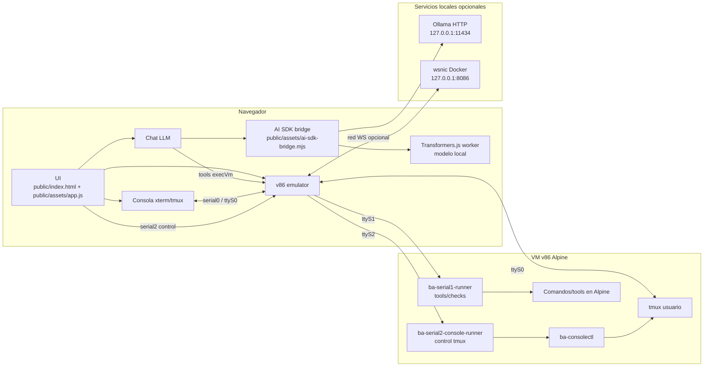

# Browser Agent v86 — Arquitectura frontend

Frontend en **TypeScript + ESM + esbuild**. `public/index.html` carga un shell pequeño: vendor global necesario, el bridge ESM del AI SDK y `public/assets/app.js`. Ese bundle se genera desde `src/main.ts` y concatena fuentes ordenadas por dominio para conservar el contrato de inicialización de VM/tmux/LLM.

La capa LLM mantiene un **bundle ESM separado** (`public/assets/chat/ai-sdk-browser.mjs`) porque importa dependencias grandes del AI SDK y usa worker propio.

## Vista general



## Dependencias y assets

Las librerías de runtime deben estar declaradas en `package.json` y copiarse desde `node_modules` con `scripts/download-v86-assets.mjs`:

- `v86` → `public/v86/build/libv86.js` y `public/v86/build/v86.wasm`
- `@xterm/xterm` → `public/vendor/xterm/xterm.js` y `public/vendor/xterm/xterm.css`
- `dompurify` → `public/vendor/llm/dompurify/purify.es.mjs`
- `streaming-markdown` → `public/vendor/llm/streaming-markdown/smd.js`

Solo quedan como descargas remotas los assets que no son librerías npm del runtime: BIOS de v86 y minirootfs Alpine. No añadir librerías nuevas directamente en `public/vendor/`; primero declararlas en npm y copiar/bundlear desde un script.

## Estructura de código servida al navegador

- `public/`: única raíz servida por `server.mjs`.
- `src/app/`: estado, bootstrap y utilidades compartidas.
- `src/vm/`: v86, perfiles, serial, red, discos, snapshots y tools de fondo.
- `src/console/`: pestañas tmux y control de consola.
- `src/ui/`: modales, checks, badges, botones y tooltips.
- `src/chat/`: estado LLM, panel, tools, artifacts, contexto y provider AI SDK.
- `public/assets/app.js`: bundle principal generado por `scripts/build-frontend.mjs`.
- `public/assets/ai-sdk-bridge.mjs`: bridge ESM generado desde `src/chat/provider/ai-sdk-bridge.ts`.
- `public/assets/chat/`: bundles generados de la capa de chat/LLM, incluido su worker.
- `public/vendor/`: librerías de terceros copiadas desde npm y servidas tal cual.

## Utilidades compartidas

`src/app/text-utils.ts` (tras `src/app/state.ts`) define helpers globales y `window.BA_TEXT_UTILS`:

- `stripAnsi`, `stripAnsiAndControls`, `normalizeNewlines`
- `trimLines` (consola serial/tmux), `trimLinesSimple` (salida serial1)
- `shellQuote`, `clampInt`, `clampExecVmOutputBytes`, `utf8ToBase64`

## Flujo de ejecución en la VM

```txt
Usuario / LLM
    → execVm() [src/vm/operations.ts]
        → targetTools=true (por defecto)
            → BA_BG_TOOLS.execVm() [src/vm/background-tools-serial1.ts]
                → /dev/ttyS1 + ba-serial1-runner (en la VM)
        → targetTools=false (solo stty en serial0)
            → serial0_send + marcadores __BAGENT_* [src/vm/serial-vm.ts]
```

La consola **tmux en ttyS0** es para el usuario. Las tools del agente no deben escribir ahí salvo el caso `targetTools: false`.

## Capa LLM (AI SDK v6 + Transformers.js/Ollama)

```txt
Usuario → sendChat → BA_LLM_AGENT.handleUserMessage
    → BA_buildAiSdkTools → tool() + zod
    → BA_AISDK.runAgentStreamTurn [provider/ai-sdk-bridge.ts → provider/ai-sdk/browser-agent-runner.ts]
        → streamText + stopWhen(stepCountIs) + prepareStep
        → transformersJS + worker [llm-browser-ai.worker.mjs] u Ollama HTTP
    → BA_LLM_TOOL_EXECUTOR → execVm → serial1
    → BA_LLM_ARTIFACTS
```

| Archivo | Responsabilidad |
|---------|-----------------|
| `src/chat/provider/ai-sdk-bridge.ts` | Bridge AI SDK: carga proveedor, expone `runAgentStreamTurn`, thinking middleware |
| `src/chat/runtime/chat-ui.ts` | Burbujas chat, tool disclosure, respuestas deterministas |
| `src/chat/runtime/agent-routing.ts` | Heurísticas VM/tools y errores GPU recuperables |
| `src/chat/runtime/agent-loop.ts` | Orquestación agente (turno, carga modelo, `BA_LLM_AGENT`) |
| `src/chat/tools/ai-tools.ts` | Puente registry → `tool()` del AI SDK |
| `src/chat/rendering/markdown-renderer.ts` | Markdown streaming (sin React/Streamdown) |
| `public/assets/chat/ai-sdk-browser.mjs` | Salida de `npm run build` |

Cada modelo en `data/llm-models.json` declara metadatos; `scripts/build-llm-models.mjs` genera `build/browser/generated/10a-llm-models-catalog.js`, que se incluye en el bundle principal.

La capa AI SDK usa un solo loop por turno: el SDK decide tool-call, ejecuta `tool.execute` y genera la respuesta final en pasos siguientes (`maxSteps`). No hay segunda pasada de sintesis fuera del SDK. Para mensajes de chat que no piden VM, `prepareStep` fuerza `toolChoice: "none"`.

Ollama se integra desde el navegador con un provider AI SDK minimo. La VM no participa en esa conexion: el browser llama a `http://127.0.0.1:11434/api/chat`. Si cambias el origen de `npm start`, configura `OLLAMA_ORIGINS` en Ollama.

## Módulos Browser Por Dominio

| Archivo | Responsabilidad |
|---------|-----------------|
| `app/state.ts`, `app/text-utils.ts`, `app/bootstrap.ts` | Estado global, helpers compartidos e inicialización DOM |
| `vm/profile-config.ts`, `vm/runtime-assets.ts`, `vm/serial-vm.ts` | Configuración de VM, assets runtime, xterm y arranque v86 |
| `vm/background-tools-serial1.ts`, `vm/console-control-serial2.ts`, `vm/operations.ts` | Tools serial1, control dedicado y operaciones red/disco/snapshot |
| `console/tmux-tabs.ts` | Pestañas tmux, splits, zoom, cierre y ayuda |
| `ui/status-controls.ts`, `ui/modal.ts`, `ui/checks-panel.ts`, `ui/tooltips.ts` | Estado visual, modales, checks y tooltips |
| `chat/state/`, `chat/runtime/`, `chat/tools/`, `chat/panel/` | Estado LLM, agent loop, artifacts, presupuesto de contexto, tools y panel |
| `chat/provider/` | Bridge browser, bundle AI SDK, Ollama, Transformers.js worker y parser de tool calls |

El bundle real del navegador es `public/assets/app.js`.

## CSS

`public/style.css` importa las hojas de `public/styles/`. No añadir hojas sueltas en `index.html`.

## Build de la VM

- Perfiles: `vm/profiles/*.json` → `scripts/build-vm-profile.mjs`
- Initramfs: `scripts/build-alpine-initramfs.sh`
- Runner serial1 (fuente única): `vm/overlay/common/usr/local/bin/ba-serial1-runner` → copiado al rootfs al empaquetar
- Runner serial2 (fuente única): `vm/overlay/common/usr/local/bin/ba-serial2-console-runner` → copiado al rootfs al empaquetar
- `ba-consolectl` sigue generándose en el script `init` del initramfs (tmux)

Tras cambiar overlay o paquetes: `npm run setup`.

## Build y scripts oficiales

```bash
npm install
npm run prepare:local   # setup + build
npm run setup   # assets VM, perfiles e imágenes de disco locales
npm run build   # frontend, catálogo LLM, vendor LLM y assets npm
npm run check   # TypeScript, manifest, sintaxis, headers y range requests
npm start
```

## Scripts internos activos

Los ficheros de `scripts/` se usan desde los comandos oficiales o desde otros scripts:

| Script | Uso |
| --- | --- |
| `setup.mjs` | Orquesta assets v86, initramfs, perfiles VM y discos locales |
| `build.mjs` | Orquesta catálogo LLM, vendor, worker AI SDK y bundle frontend |
| `clean.mjs` | Limpia artefactos generados no versionados |
| `check-frontend-manifest.mjs` | Valida bundles y assets mínimos del frontend |
| `check-js-syntax.mjs` | Valida sintaxis de JavaScript generado/servido |
| `check-server.mjs` | Valida headers COOP/COEP/CORP, cache y range requests |
| `download-v86-assets.mjs` | Copia/descarga runtime v86 y vendors npm necesarios |
| `build-alpine-initramfs.sh` | Construye initramfs Alpine con overlay y runners |
| `build-vm-profile.mjs` | Genera imágenes de perfil desde `vm/profiles/*.json` |
| `create-v86-disks.sh` | Crea discos HDA locales de 250 MB, 512 MB y 1 GB |
| `build-frontend.mjs` | Compila TypeScript de `src/` a `public/assets/app.js` |
| `build-llm-ai-bundle.mjs` | Compila bridge y worker LLM del provider AI SDK |
| `build-llm-models.mjs` | Genera el catálogo browser desde `data/llm-models.json` |

## Reglas de mantenimiento

1. Código nuevo de aplicación → preferir `src/` con TypeScript.
2. Mantener el orden de inicialización solo en `browserSourceOrder` de `scripts/build-frontend.mjs`; no volver a poner listas largas en `index.html`.
3. Cambios en imports AI SDK → `npm run build` y distribuir los bundles generados en el zip runtime.
4. Nuevo `.css` en `public/styles/` → `@import` en `public/style.css`.
5. No duplicar catálogos de tools (usar `src/chat/tools/tool-registry.ts`).
6. Probar nano/pantalla completa tras tocar geometría serial o tmux.
7. Documentación nueva → mantenerla en `README.md`, `docs/USAGE.md` o `docs/ARCHITECTURE.md`.

## Memoria y globals

La UI expone APIs en `window.BA_*`. Existe además `window.BA`, instalado desde `src/compat/window-api.ts`, como punto de compatibilidad y debug. Esto no es el mayor coste de memoria; lo pesado son VM, modelo ONNX/WebGPU, buffers de serial, artifacts y logs. La regla actual es:

- los módulos nuevos deben ser TypeScript en `src/`;
- exponer en `window` solo el API público usado por consumidores reales;
- mantener logs, historial y artifacts con límites explícitos;
- no guardar salidas completas de tools en mensajes del modelo; usar artifacts y vistas compactas.
