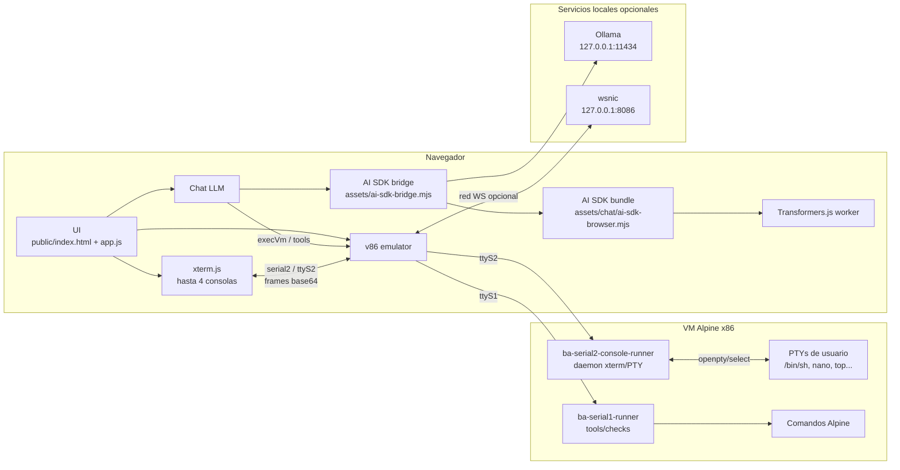

# Browser Agent v86 - Arquitectura

La aplicación es un frontend **TypeScript + ESM + esbuild** servido desde `public/`. El navegador carga `public/index.html`, vendors globales mínimos, el bridge ESM del AI SDK y el bundle principal `public/assets/app.js`.

La VM corre con **v86** y Alpine x86. La capa LLM usa **AI SDK v6** con backends Transformers.js y Ollama. Las tools del agente se ejecutan dentro de la VM por un canal serial separado de la consola visible.

## Vista general



## Raiz servida

`public/` es la única raíz HTTP:

- `public/index.html`: shell estático de la UI.
- `public/style.css`: único CSS enlazado desde HTML; importa `public/styles/*.css`.
- `public/assets/app.js`: bundle principal generado.
- `public/assets/ai-sdk-bridge.mjs`: bridge ESM generado.
- `public/assets/chat/`: bundle AI SDK y worker LLM generados.
- `public/vendor/`: librerías copiadas desde npm.
- `public/v86/`: runtime v86, BIOS, kernel, initramfs, perfiles y discos.
- `public/_headers`: cabeceras para despliegues estáticos compatibles.

`server.mjs` solo sirve `public/` y añade COOP/COEP/CORP, MIME para `.wasm`, cache por tipo y `Range`.

## Build frontend

`scripts/build-frontend.mjs` genera:

- `public/assets/app.js`
- `public/assets/ai-sdk-bridge.mjs`

El entry `src/main.ts` instala `window.BA` desde `src/compat/window-api.ts`. Después el script concatena fuentes TypeScript en el orden `browserSourceOrder`. Este orden mantiene contratos globales históricos mientras los módulos se migran por dominio.

Regla: si cambia el orden de inicializacion del browser, se modifica solo `browserSourceOrder` en `scripts/build-frontend.mjs`.

## Build LLM

`scripts/build.mjs` ejecuta, en orden:

1. `scripts/build-llm-models.mjs`
2. `scripts/download-v86-assets.mjs`
3. `scripts/build-llm-ai-bundle.mjs`
4. `scripts/build-frontend.mjs`

Salidas LLM:

- `build/browser/generated/10a-llm-models-catalog.js`, generado desde `data/llm-models.json`.
- `public/assets/chat/ai-sdk-browser.mjs`, generado desde `src/chat/provider/ai-sdk/entry.ts`.
- `public/assets/chat/workers/llm-browser-ai.worker.mjs`, generado desde `src/chat/provider/ai-sdk/llm-browser-ai.worker.ts`.
- `public/assets/ai-sdk-bridge.mjs`, generado desde `src/chat/provider/ai-sdk-bridge.ts`.

El bridge importa el bundle generado con query versionada y expone `window.BA_AISDK`.

## Assets de runtime

Las librerías de runtime deben estar declaradas en `package.json` y copiarse desde `node_modules` con `scripts/download-v86-assets.mjs`:

| Dependencia | Salida |
| --- | --- |
| `v86` | `public/v86/build/libv86.js`, `public/v86/build/v86.wasm` |
| `@xterm/xterm` | `public/vendor/xterm/xterm.js`, `public/vendor/xterm/xterm.css` |
| `dompurify` | `public/vendor/llm/dompurify/purify.es.mjs` |
| `streaming-markdown` | `public/vendor/llm/streaming-markdown/smd.js` |

Solo se descargan remotamente los assets que no son librerías npm del runtime: BIOS de v86 y minirootfs Alpine. No anadir librerías nuevas directamente en `public/vendor/`; declararlas en npm y copiarlas o bundlearlas desde scripts.

## Dominios de código

| Ruta | Responsabilidad |
| --- | --- |
| `src/app/` | Estado global, bootstrap, helpers de texto y avisos de origen |
| `src/vm/` | v86, perfiles, assets, seriales, red, discos, snapshots y operaciones VM |
| `src/console/` | Pestañas xterm, sesiones PTY, cierre y refresco |
| `src/ui/` | Estado visual, modales, checks y tooltips |
| `src/chat/state/` | Estado LLM, modelos y capacidades |
| `src/chat/panel/` | Panel LLM, controles y vista de capacidades |
| `src/chat/runtime/` | Agent loop, UI de chat, routing, artifacts, contexto y recursos |
| `src/chat/tools/` | Registry de tools, políticas y ejecutor |
| `src/chat/provider/` | Bridge AI SDK, provider Ollama, Transformers.js worker y parser/middleware de tool calls |
| `src/compat/` | API publica `window.BA` |
| `src/core/` | Eventos compartidos |

## Globals y API publica

La aplicación aun expone varios `window.BA_*` porque el bundle principal conserva dependencias globales ordenadas. El punto de compatibilidad público es `window.BA`, instalado por `src/compat/window-api.ts`.

Globals principales:

- `window.BA`: versión, origen y eventos públicos.
- `window.BA_TEXT_UTILS`: helpers de texto y shell.
- `window.BA_BG_TOOLS`: ejecución por `serial1`.
- `window.BA_CONSOLE_CONTROL`: control xterm/PTY por `serial2`.
- `window.BA_AISDK`: bridge/provider LLM.
- `window.BA_LLM_*`: estado, UI, tools, artifacts, contexto y recursos del chat.

Regla: los módulos nuevos deben vivir en `src/` y exponer globals solo cuando haya consumidores reales.

## Seriales y ejecución VM

```txt
Usuario / LLM
  -> execVm() [src/vm/operations.ts]
    -> targetTools=true (por defecto)
      -> window.BA_BG_TOOLS.execVm()
      -> serial1 / ttyS1
      -> ba-serial1-runner
    -> targetTools=false
      -> serial0 / ttyS0 con marcadores __BAGENT_*
```

Contratos actuales:

- `serial0` / `/dev/ttyS0`: arranque, login base y fallback serial.
- `serial1` / `/dev/ttyS1`: tools del LLM, checks, formulario manual y operaciones internas que no deben ensuciar la consola visible.
- `serial2` / `/dev/ttyS2`: daemon xterm/PTY. Multiplexa hasta 4 PTYs reales hacia xterm.js con frames base64.
- No hay fallback silencioso de `serial1` a `serial0` en `execVm(targetTools=true)`.

Fuentes de runners:

- `vm/overlay/common/usr/local/bin/ba-serial1-runner`
- `vm/overlay/common/usr/local/bin/ba-serial2-console-runner`

## VM e imágenes

`scripts/setup.mjs` ejecuta:

1. `scripts/download-v86-assets.mjs`
2. `scripts/build-alpine-initramfs.sh`
3. `scripts/build-vm-profile.mjs vm/profiles/alpine-base.json`
4. `scripts/build-vm-profile.mjs vm/profiles/alpine-pentest-lite.json`
5. `scripts/build-vm-profile.mjs vm/profiles/alpine-pentest-web.json`
6. `scripts/create-v86-disks.sh`

`scripts/build-vm-profile.mjs` genera manifests en `public/v86/images/profiles/` y mantiene `index.json`. Los perfiles usan initramfs; los discos HDA creados por `scripts/create-v86-disks.sh` son imágenes ext2 raw para datos.

El daemon de consola se instala desde `vm/overlay/common/usr/local/bin/ba-serial2-console-runner`. Tras cambiar overlay, perfiles, runners o build de Alpine, ejecutar `npm run setup`.

## Capa LLM

Flujo de un turno:

```txt
sendChat()
  -> window.BA_LLM_AGENT.handleUserMessage()
  -> window.BA_buildAiSdkTools()
  -> window.BA_AISDK.runAgentStreamTurn()
    -> streamText()
    -> stopWhen(stepCountIs(maxSteps))
    -> prepareStep()
  -> tool.execute()
  -> window.BA_LLM_TOOL_EXECUTOR.runTool()
  -> execVm()
  -> serial1 / ba-serial1-runner
  -> artifacts + respuesta de chat
```

Detalles importantes:

- `prepareStep` oculta tools devolviendo `tools: {}` cuando el turno no necesita VM o cuando el paso posterior debe sintetizar en prosa.
- En el primer paso con tools, `prepareStep` puede restringir `activeTools` al subconjunto permitido.
- El runner usa el loop de AI SDK (`streamText` + `stopWhen(stepCountIs)`), pero contiene una síntesis de respaldo si hubo tool work y la respuesta textual falta, parece un plan de tool o falla el paso de síntesis del SDK.
- El middleware de Transformers.js elimina `toolChoice` para compatibilidad con ese backend.
- Ollama se llama desde el navegador, no desde la VM. El endpoint por defecto es `http://127.0.0.1:11434`.

Archivos clave:

| Archivo | Responsabilidad |
| --- | --- |
| `src/chat/provider/ai-sdk-bridge.ts` | Crea/carga modelos, fallback WebGPU->WASM, Ollama y `window.BA_AISDK` |
| `src/chat/provider/ai-sdk/browser-agent-runner.ts` | Turno AI SDK, steps, streaming y síntesis de respaldo |
| `src/chat/provider/ai-sdk/ollama-browser-model.ts` | Provider Ollama HTTP browser |
| `src/chat/provider/ai-sdk/llm-browser-ai.worker.ts` | Worker Transformers.js |
| `src/chat/tools/ai-tools.ts` | Adaptador registry -> `tool()` del AI SDK |
| `src/chat/tools/tool-executor.ts` | Ejecuta tools vía `execVm` y publica eventos |
| `src/chat/tools/tool-registry.ts` | Catálogo único de tools por contexto/perfil |
| `src/chat/runtime/context-budget.ts` | Presupuesto de contexto y tokens |
| `src/chat/runtime/artifact-store.ts` | Persistencia compacta de resultados de tools |
| `src/chat/rendering/markdown-renderer.ts` | Markdown streaming sin React |

## Checks

`npm run check` ejecuta:

- `tsc --noEmit`
- `scripts/check-frontend-manifest.mjs`
- `scripts/check-js-syntax.mjs`
- `scripts/check-server.mjs`

`check-server` arranca `server.mjs` en `127.0.0.1:5199` y valida COOP, COEP, CORP y `Range`.

## Reglas de mantenimiento

1. Codigo nuevo de aplicación en `src/` con TypeScript.
2. Cambios de orden del bundle principal solo en `browserSourceOrder`.
3. Nuevo CSS en `public/styles/` y `@import` desde `public/style.css`.
4. Nuevas librerías browser vía `package.json` + script de copia/bundle, no copiadas a mano en `public/vendor/`.
5. Nuevo modelo en `data/llm-models.json` y regeneracion con `npm run build`.
6. Nueva tool en `src/chat/tools/tool-registry.ts`; no duplicar catálogos.
7. Cambios en perfiles, overlay o runners requieren `npm run setup`.
8. Cambios en provider AI SDK o worker requieren `npm run build`.
9. Mantener limites explicitos para logs, artifacts, historial y salidas de tools.
10. Probar consolas xterm, cierre, refresco, programas de pantalla completa y tools tras tocar seriales o geometría de consola.
