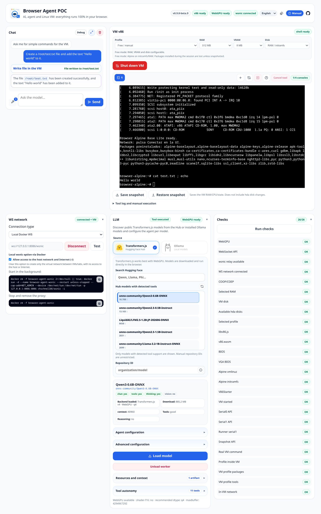

# Browser Agent v86 POC User Manual

> **English** | [Español](USER_MANUAL.es.md)

This manual covers using the application itself. It does not cover installation, development, profile generation, or repository scripts.

## Overview

Browser Agent v86 POC has three main work areas:

- **Chat**: conversation with an LLM running locally in the browser or through a local Ollama instance.
- **VM**: an x86 Linux machine running in v86, with profiles, consoles, disks, and snapshots.
- **Bottom panels**: wsnic networking, LLM information, and status checks.



The header shows global status:

- **Version**: current application version.
- **v86**: VM status.
- **WebGPU/WASM**: inference backend available for local models. It may show WebGPU or WASM depending on what the browser supports.
- **WS**: wsnic network status.
- **Language**: ES/EN selector. It switches the UI without reloading the page or losing the VM.
- **Theme**: a combined sun-and-moon, sun, or moon button cycles through System, Light, and Dark. The choice is kept for later visits.
- **GitHub**: opens the project repository.

## Recommended workflow

1. Select the VM **Profile** you want to use.
2. Press **Start VM**. On first use it may download large assets; wait until the console shows the shell.
3. If the browser supports **WebGPU**, you can use a local Transformers.js model or connect to a model in Ollama from the **LLM** panel. Transformers.js downloads and caches its models in the browser. If you only have **WASM**, Ollama or another browser/device with WebGPU is usually a better choice for agent and tool use.
4. Use the chat to request actions inside the VM, or use the consoles to inspect the system and run commands manually.
5. If you need outbound network access inside the VM, configure **wsnic** from the **WS network** panel.

You can press **Run checks** at any time to verify whether the application, VM, network, assets, and tools are healthy.

## Chat

The chat panel is on the left on desktop and above the VM on mobile.

- **Expand chat** switches between split view and full-width chat.
- **Clear chat** clears the visible history, internal LLM history, and all saved tool artifacts.
- **Tools button** opens the selector for tools the agent may use. Available tools vary by selected VM profile.
- **Message field** stays disabled until a model is ready; see the **LLM panel** section.
- **Send / stop** sends the message; during generation it can stop the active turn.

Use concrete prompts. For example: "check the VM IP", "list /etc", "send a HEAD request to this authorized host", "create a Python script that processes this file and saves it in `/tmp`", or "summarize the last artifact".

Tool-enabled chat quality depends heavily on the selected model. Some models follow instructions and handle tool calls better than others. The smaller the model's context window, the more useful it is to limit the number of active tools in a request to reduce noise, memory use, and planning errors.

## VM, profiles, and disks

Before booting you can configure:

| Control | Purpose |
| --- | --- |
| **Profile** | Selects a prepared Alpine profile. |
| **RAM** | Main memory in **Free / manual** mode. Selecting a generated profile applies its recommended value. |
| **VRAM** | Video memory in **Free / manual** mode. |
| **Disk** | Selects RAM/initramfs-only execution or a data HDA disk. |

Common profiles:

| Profile | Recommended use |
| --- | --- |
| `alpine-base` | Minimal Alpine shell with basic utilities. |
| `alpine-pentest-lite` | Light reconnaissance with tools such as nmap and ffuf. |
| `alpine-pentest-web` | Broader web testing with additional tools such as nikto/httpx. |

HDA disks are data disks. The system boots from initramfs; if you choose an HDA disk, mount or unmount it with the disk button once the VM is ready. Snapshots save VM state, but they are not a replacement for a persistence strategy for important data.

### VM controls

- **Start VM / Shut down VM** starts or stops the VM. Shutting down discards changes that have not been saved in a snapshot or on a persistent disk.
- **Mount disk / Unmount disk** appears when an HDA disk is selected.
- **New console** creates another xterm tab, up to the four-console limit.
- **Rename console** lets you change a tab name by double-clicking its label, which helps organize several sessions.
- **Redraw console** forces the active console to repaint.
- **Close console** closes the active xterm tab when it is not the base console.
- **Console help** explains serial channels, PTYs, and tool separation.
- **Cancel tool** attempts to cancel a running background tool.

### Consoles

The first console uses `serial0` and shows the VM's boot console. Additional consoles use PTYs inside the VM over `serial2`.

Agent tools, checks, and the manual command form do not write to the visible console: they use `serial1` / `/dev/ttyS1`. This separation prevents a tool from cluttering or blocking the interactive session.

### Running commands manually and viewing the tool log

Below the VM, the interface provides a tool log and a manual command form.

- The log shows internal operations, network events, snapshots, disk actions, and tool output.
- The command field runs a command inside the VM through `serial1`.
- While a tool is active, some controls are locked until it finishes or is cancelled.

This form is useful for quick diagnostic commands. Use the console tabs for interactive work.

### Snapshots

- **Save snapshot** downloads a `.v86state` file with the current VM state.
- **Restore snapshot** prompts for a state file and starts the VM from that saved state.
- Restore a snapshot with the same RAM, disk, and profile configuration used when it was created.
- Snapshots may not include data written to HDA disks; check the tool log warnings.

Before shutting down the VM, save a snapshot if you want to keep RAM/process state.

## LLM panel

The **LLM** panel lets you choose and load the inference engine:

- **Source** switches between Transformers.js and Ollama. Changing source unloads the previous model and clears its loading errors.
- **Transformers.js** searches Hugging Face. The list only shows repositories with detected tool support, has a refresh button beside its heading, and appends **Load more** at the end while more results are available.
- **Repository ID** accepts a model that is not in the list. Typing an ID deselects the previous result; use the information button inside the field to inspect its metadata. If inspection fails, the reason appears directly below it.
- **Ollama endpoint** is usually `http://127.0.0.1:11434`; the list shows installed models that announce tool support and can be refreshed from the icon beside its heading.
- The selected-model card summarizes the engine, download size, quantization, context, and detected capabilities. **Agent configuration** and **Advanced configuration** control its behavior; **Restore defaults** restores the initial values for the current engine/model.
- **Load model** initializes the selected backend. For Transformers.js, it downloads or reuses the cached model and starts a worker; for Ollama, it checks the endpoint and local model. During download, the shared application overlay identifies the current phase or component and **Cancel download** stops it without reloading the page.
- If loading fails, the error appears next to **Load model**. It is cleared when you select another source, model, or ID so it cannot be mistaken for the next attempt.
- **Show model reasoning (thinking)** controls whether generated reasoning is visible.
- **Resources and context** shows context budget, artifacts, and active operation.
- **Tool autonomy** sets the highest risk level the agent may execute without asking for confirmation.
- **Unload worker** stops generation and releases the active Transformers.js worker and model. It is disabled for Ollama models because they run outside the browser.

WebGPU is the recommended path for local models. If WebGPU fails and the model supports it, the app may try the experimental WASM fallback.

The application retains the last selected engine/model and its configuration. Model files may remain in the browser cache.

While chat is responding, controls that would change the loaded runtime are locked, including source/model, device, dtype, cache, and thinking generation/parsing. Autonomy is also locked so approvals cannot change in the middle of a turn. Agent, tool-selection, sampling, context, and reasoning-display settings can be prepared for the next turn without stopping the current response. If you change a runtime setting while chat is idle, you must load the model again.

### Ollama

Ollama runs outside the browser, usually on your own machine. The browser calls the Ollama HTTP endpoint directly, by default `http://127.0.0.1:11434`.

For it to work from the app, Ollama must allow the origin where you open Browser Agent. Set `OLLAMA_ORIGINS` before starting Ollama.

Example for local use:

```bash
OLLAMA_ORIGINS=http://127.0.0.1:5173 ollama serve
```

Example for the published demo:

```bash
OLLAMA_ORIGINS=https://browseragent.icu ollama serve
```

If you serve the app from another port or domain, use that exact origin. The selected model must also exist in your local Ollama; if it does not, install it with `ollama pull <model>`.

### Tools

Inside the **LLM** panel, tools control how the chat interacts with the VM. They are actions the chat can execute inside the VM: reading files, writing files, running controlled commands, checking packages, inspecting network state, making HTTP requests, or launching pentest tools allowed by the active profile.

- Enable or disable tools from the chat wrench button.
- Available tools depend on the selected profile. For example, pentest profiles expose tools that do not appear in the base profile.
- Each tool has a security level: level 1 for bounded reads, level 2 for low-impact diagnostics, and level 3 for active actions such as controlled commands or light scans.
- **Tool autonomy** sets the highest level the agent can run without confirmation. Tools above that level display a confirmation prompt before running.
- The tools selector lets you reduce how many tools the model sees in one request. This helps with smaller models or models with limited context.

Use network and pentest tools only against systems you own or are authorized to test.

### Artifacts

Artifacts are actual tool results saved by the **LLM** panel so they do not flood the chat or get resent to the model on every turn.

- The app keeps up to **10 recent artifacts**, with an approximate total limit of **1 MB**. If the limit is exceeded, the oldest artifacts are removed first.
- Each artifact may contain truncated output: the on-screen preview and the compact text for the model have different limits.
- You can open an artifact preview from **Resources and context**.
- You can attach an artifact to the next message when the model has enough context budget. If there is no room, the UI marks it as not sendable.
- You can detach an artifact from context, delete individual artifacts, or clear all artifacts from the panel.

## wsnic networking

VM networking is optional and offers three types:

- **Local Docker WS**: the default. The UI shows the Docker commands and lets you enable Internet with `-i` or keep an isolated network between VMs/tabs without `-i`.
- **Public relay**: uses `wss://relay.widgetry.org/`. It is shared, limited, and has no SLA or privacy or availability guarantees.
- **Custom**: accepts a `ws://` or `wss://` URL. With WSS, the browser validates the certificate, hostname, and trust chain.

The URL is editable only under **Custom**. **Test** checks the handshake, **Connect / Disconnect** controls the connection, and unexpected interruptions use progressive reconnection. Chrome may require local-network permission for `127.0.0.1`.

See [USAGE.en.md](USAGE.en.md#ws-network) for secure setup.

### Optional: access from the host (Linux)

Only if you want **your computer** (outside the browser) to reach the VM — for example to test a server you start in the VM from the host. This is not required to use the network inside the VM.

By default wsnic uses `192.168.86.0/24` (gateway `192.168.86.1`). Each connected tab gets its own IP (e.g. `.2` and `.3` with two VMs). Check it in the VM console with `ip -4 addr`.

> **Warning:** if your LAN already uses `192.168.86.0/24`, you may get routing conflicts. Start wsnic with a different subnet (`-s`, e.g. `192.168.87.0/24`); that option is not in the UI’s default Docker command.

The bridge runs inside the Docker container. Route the subnet via the container IP on `docker0`:

```bash
WSNIC_IP=$(docker inspect -f '{{range .NetworkSettings.Networks}}{{.IPAddress}}{{end}}' browser-agent-wsnic)
sudo ip route add 192.168.86.0/24 via "$WSNIC_IP" dev docker0
ping -c 2 192.168.86.2   # replace with your VM’s IP
```

With the route active you can use VM services (HTTP, test ports, etc.) from the host. You can run this while everything is already up; do not restart the container, VM, or browser. If the route already exists: `sudo ip route replace ...` (same parameters). To remove it: `sudo ip route del 192.168.86.0/24 via "$WSNIC_IP" dev docker0`. After a host **reboot**, run the block again once the container is up.

Alternative without host routes: `docker run --rm -it --network container:browser-agent-wsnic alpine`, then `ping` or `curl` the VM IP from there.

## Checks

The **Run checks** panel validates environment and runtime state:

- headers required for `SharedArrayBuffer`;
- v86 and vendor assets;
- WebGPU/WASM availability;
- snapshot APIs;
- serial channels and runners when the VM is active;
- packages and tools expected by the active profile.

On an isolated **Local Docker WS** network with Internet disabled, the check validates the interface and IPv4 address without waiting for an impossible external connection. In other modes, the HTTP probe makes one attempt with a 5-second timeout before falling back to ping.

If a check fails, review its details and the tool log before trying again.

## Common states and errors

| State or error | Meaning | Recommended action |
| --- | --- | --- |
| **v86 inactive / off** | The VM has not started yet. | Choose profile/disk and press **Start VM**. |
| **WebGPU unavailable** | The browser or device does not expose compatible WebGPU. | Use another browser/device or a model with WASM fallback. |
| **serial1 not ready** | The tools runner is not responding inside the VM yet. | Wait for full boot and run **Run checks**. |
| **tool running** | A background operation is active. | Wait or press **Cancel tool** when appropriate. |
| **model not loaded** | Chat cannot generate yet. | Open **LLM**, choose backend/model, and press **Load model**. |
| **wsnic cannot connect** | The local WebSocket proxy is unavailable or not responding. | Check the **WS network** panel URL and local wsnic service. |
| **snapshot error** | The app could not save or restore state. | Check memory, selected file, and configuration compatibility. |
| **disk not mounted** | An HDA disk is selected but not mounted in the VM. | Press **Mount disk** when the shell is ready. |

## Best practices

- Start with `alpine-base` if you only need to test the VM.
- Use an Ollama model if your browser does not support WebGPU properly, or try another browser with WebGPU support. You can check compatibility at [Can I use WebGPU](https://caniuse.com/webgpu).
- Enable fewer tools if the local model responds poorly or uses too much memory.
- Keep concurrency low for network tools inside v86.
- Save a snapshot before long operations or changes you do not want to lose.
- Check the tool log when chat says a tool failed or generated an artifact.
