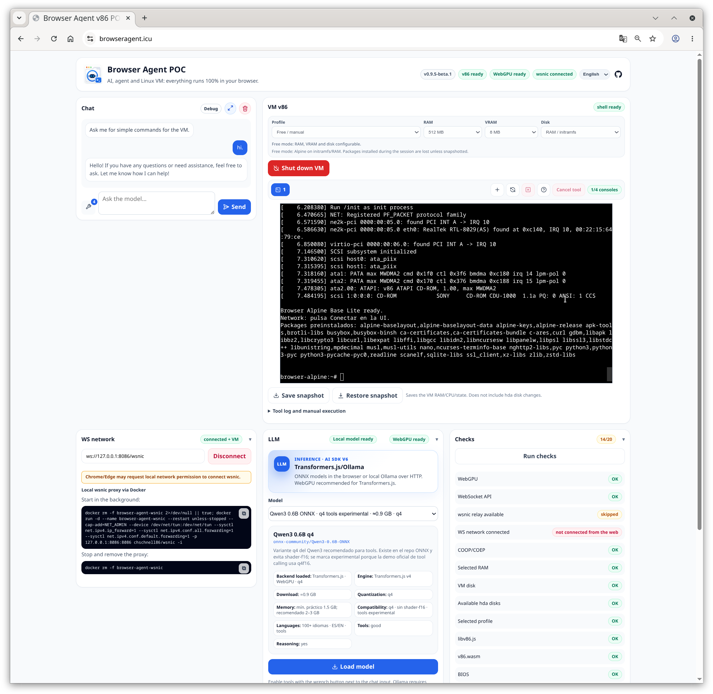

# Manual de uso de Browser Agent v86 POC

> [English](USER_MANUAL.en.md) | **Español**

Este manual explica como usar la aplicacion ya abierta. No cubre instalacion, desarrollo, generacion de perfiles ni scripts del repositorio.

## Vista general

Browser Agent v86 POC combina tres zonas de trabajo:

- **Chat**: conversacion con un LLM local del navegador o con Ollama local.
- **VM**: maquina Linux x86 ejecutada con v86, con perfiles, consolas, discos y snapshots.
- **Paneles inferiores**: red wsnic, informacion LLM y comprobaciones de estado.




La cabecera muestra el estado global:

- **Versión**: versión actual de la aplicación.
- **v86**: estado de la VM.
- **WebGPU/WASM**: backend de inferencia disponible para modelos locales. Puede mostrar WebGPU o WASM según lo que acepte el navegador.
- **WS**: estado de la red wsnic.
- **Idioma**: selector ES/EN. Cambia la interfaz sin recargar la página ni perder la VM.
- **GitHub**: abre el repositorio del proyecto.

## Flujo recomendado

1. Selecciona el **Perfil** de VM que quieres usar.
2. Pulsa **Arrancar VM**. La primera vez puede descargar assets grandes; espera a que la consola muestre la shell.
3. Si el navegador acepta **WebGPU**, puedes usar un modelo Transformers.js local o un modelo Ollama y cargarlo desde el panel **LLM**. Transformers.js descarga y cachea el modelo en el navegador. Si solo tienes **WASM**, para uso con agente y tools suele ser mejor usar Ollama o probar otro navegador/equipo con WebGPU.
4. Habla con el chat para pedir acciones dentro de la VM, o usa las consolas para comprobar y ejecutar lo que necesites manualmente.
5. Si necesitas salida de red dentro de la VM, configura **wsnic** desde el panel **Red WS**.

Puedes pulsar **Comprobar** en cualquier momento para revisar si la aplicación, la VM, la red, los assets y las tools están en buen estado.

## Chat

El panel de chat esta a la izquierda en escritorio y arriba en movil.

- **Expandir chat** cambia entre vista dividida y chat a ancho completo.
- **Limpiar chat** borra el historial visible, el historial interno del LLM y todos los artifacts de tools guardados.
- **Botón de tools** abre el selector de herramientas que el agente puede usar. Las tools disponibles varían según el perfil de VM seleccionado.
- **Campo de mensaje** queda deshabilitado hasta que haya un modelo listo; consulta el apartado **Panel LLM**.
- **Enviar / detener** envía el mensaje; durante una generación puede detener el turno activo.

Usa prompts concretos. Por ejemplo: "comprueba la IP de la VM", "lista /etc", "haz una petición HEAD a este host autorizado", "crea un script Python que procese este fichero y guárdalo en `/tmp`" o "resume el último artifact".

La calidad del chat con tools depende mucho del modelo elegido. Algunos modelos siguen instrucciones y llamadas a herramientas mejor que otros. Además, cuanto menor sea el contexto del modelo, más conviene limitar la cantidad de tools activas en una petición para reducir ruido, uso de memoria y errores de planificación.

## VM, perfiles y discos

Antes de arrancar puedes configurar:

| Control          | Funcion                                                                                            |
| ---------------- | -------------------------------------------------------------------------------------------------- |
| **Perfil** | Selecciona una imagen Alpine preparada.                                                            |
| **RAM**    | Memoria principal en modo **Libre / manual**. En perfiles generados se aplica la recomendada. |
| **VRAM**   | Memoria de video en modo **Libre / manual**.                                                  |
| **Disco**  | Selecciona ejecucion solo en RAM/initramfs o un disco HDA de datos.                                |

Perfiles habituales:

| Perfil                  | Uso recomendado                                                          |
| ----------------------- | ------------------------------------------------------------------------ |
| `alpine-base`         | Shell Alpine minima con utilidades basicas.                              |
| `alpine-pentest-lite` | Reconocimiento ligero con herramientas como nmap y ffuf.                 |
| `alpine-pentest-web`  | Pruebas web mas completas con herramientas adicionales como nikto/httpx. |

Los discos HDA son discos de datos. El sistema arranca desde initramfs; si eliges un HDA, monta o desmonta el disco con el boton de disco cuando la VM este lista. Los snapshots guardan el estado de la VM, pero no sustituyen a una estrategia de persistencia para datos importantes.

### Controles de VM

- **Arrancar VM / Apagar VM** inicia o detiene la VM. Al apagar se pierden cambios que no esten en snapshot o en disco persistente.
- **Montar disco / Desmontar disco** aparece cuando hay un HDA seleccionado.
- **Nueva consola** crea una pestaña xterm adicional, hasta el limite de la aplicacion.
- **Renombrar consola** permite cambiar el nombre de una pestaña con doble clic sobre su etiqueta para organizar mejor varias sesiones.
- **Redibujar consola** fuerza el repintado de la consola activa.
- **Cerrar consola** cierra la pestaña xterm activa si no es la consola base.
- **Ayuda de consola** explica seriales, PTY y separacion de tools.
- **Cancelar tool** intenta cancelar una herramienta background en ejecucion.

### Consolas

La primera consola usa `serial0` y muestra el arranque base de la VM. Las consolas adicionales usan PTY dentro de la VM por `serial2`.

Las tools del agente, las comprobaciones y el formulario manual no escriben en la consola visible: usan `serial1` / `/dev/ttyS1`. Esta separacion evita que una tool ensucie o bloquee la sesion interactiva.

### Ejecucion manual y log de tools

Debajo de la VM hay un log de tools y un formulario de comando manual.

- El log muestra ejecuciones internas, red, snapshots, disco y salida de tools.
- El campo de comando ejecuta una orden dentro de la VM por `serial1`.
- Si una tool esta activa, algunos controles se bloquean hasta que termine o se cancele.

Este formulario es util para comandos cortos de comprobacion. Para trabajo interactivo usa las pestañas de consola.

### Snapshots

- **Guardar snapshot** descarga un fichero `.v86state` con el estado actual de la VM.
- **Restaurar snapshot** pide un fichero de estado y reinicia/restaura la VM.
- Restaura el snapshot con la misma configuración de RAM, disco y perfil con la que se creó.
- Los snapshots pueden no incluir datos escritos en discos HDA; revisa los avisos del log.

Antes de apagar la VM, guarda snapshot si quieres conservar el estado de RAM/procesos.

## Panel LLM

El panel **LLM** permite elegir y cargar el motor de inferencia:

- **Fuente** cambia entre Transformers.js y Ollama. Al cambiar de fuente se descarga el modelo anterior y se limpian sus errores de carga.
- **Transformers.js** permite buscar en Hugging Face. El listado muestra repositorios con soporte de tools detectado, dispone de un botón de refresco junto al título y añade **Cargar más** al final cuando existen más resultados.
- **ID del repositorio** permite usar un modelo que no aparece en el listado. Escribirlo deselecciona el resultado anterior; pulsa el botón de información integrado en el campo para consultar sus metadatos. Si la consulta falla, el motivo aparece justo debajo.
- **Ollama endpoint** usa normalmente `http://127.0.0.1:11434`; el listado muestra modelos instalados que anuncian soporte de tools y puede refrescarse desde el icono junto a su título.
- La tarjeta del modelo seleccionado resume motor, descarga, cuantización, contexto y capacidades detectadas. **Configuración del agente** y **Configuración avanzada** permiten ajustar su comportamiento; **Restaurar defaults** recupera los valores iniciales del motor/modelo actual.
- **Cargar modelo** inicializa el backend seleccionado. En Transformers.js descarga o reutiliza el modelo cacheado y arranca un worker; en Ollama comprueba el endpoint y el modelo local. Durante la descarga aparece el overlay general con la fase o componente en curso y **Cancelar descarga** permite detenerla sin recargar la página.
- Si la carga falla, el error se muestra junto a **Cargar modelo**. Se elimina al elegir otra fuente, modelo o ID para no confundirlo con el siguiente intento.
- **Mostrar razonamiento del modelo (thinking)** controla si se ve el razonamiento generado.
- **Recursos y contexto** muestra presupuesto de contexto, artifacts y operacion activa.
- **Autonomia de tools** define el nivel de riesgo máximo que el agente puede ejecutar sin pedir permiso.
- **Descargar worker** detiene la generación y libera el worker y el modelo activos de Transformers.js. Está deshabilitado con modelos Ollama porque se ejecutan fuera del navegador.

WebGPU es la ruta recomendada para modelos locales. Si WebGPU falla y el modelo lo permite, la aplicacion puede intentar fallback WASM experimental.

La aplicación conserva el último motor/modelo seleccionado y su configuración. Los archivos del modelo pueden permanecer en la caché del navegador.

Mientras el chat responde se bloquean los controles que cambiarían el runtime cargado, como fuente/modelo, device, dtype, cache y generación/parsing de thinking. La autonomía también queda bloqueada para no cambiar las aprobaciones a mitad del turno. Los ajustes de agente, selección de tools, sampling, contexto y visualización del razonamiento se pueden preparar para el turno siguiente sin detener la respuesta actual. Si cambias un ajuste de runtime cuando el chat está inactivo, tendrás que volver a cargar el modelo.

### Ollama

Ollama se ejecuta fuera del navegador, normalmente en tu equipo. El navegador llama directamente al endpoint HTTP de Ollama, por defecto `http://127.0.0.1:11434`.

Para que funcione desde la app, Ollama debe permitir el origen desde el que abres Browser Agent. Configura la variable de entorno `OLLAMA_ORIGINS` antes de arrancar Ollama.

Ejemplo para uso local:

```bash
OLLAMA_ORIGINS=http://127.0.0.1:5173 ollama serve
```

Ejemplo para la demo publicada:

```bash
OLLAMA_ORIGINS=https://browseragent.icu ollama serve
```

Si sirves la app desde otro puerto o dominio, usa ese origen exacto. Además, el modelo elegido debe existir en tu Ollama local; si no existe, instálalo con `ollama pull <modelo>`.

### Tools

Dentro del panel **LLM**, las tools controlan como el chat interactua con la VM. Son acciones que el chat puede ejecutar dentro de la VM: leer ficheros, escribir ficheros, ejecutar comandos controlados, consultar paquetes, comprobar red, hacer peticiones HTTP o lanzar herramientas de pentest permitidas por el perfil.

- Activa o desactiva tools desde el boton de llave del chat.
- Las tools disponibles dependen del perfil seleccionado. Por ejemplo, los perfiles de pentest muestran herramientas que no aparecen en el perfil base.
- Cada tool tiene un nivel de seguridad: nivel 1 para lectura acotada, nivel 2 para diagnostico de bajo impacto y nivel 3 para acciones activas como comandos controlados o escaneos ligeros.
- La **Autonomia de tools** decide hasta que nivel puede actuar el agente sin pedir confirmacion. Los niveles superiores al permitido muestran confirmacion antes de ejecutarse.
- El selector de tools permite reducir cuantas herramientas ve el modelo en una peticion. Esto ayuda con modelos pequeños o con poco contexto.

Usa tools de red y pentest solo contra sistemas propios o con autorizacion.

### Artifacts

Los artifacts son resultados reales de tools guardados por el panel **LLM** para no saturar el chat ni reenviar salidas largas al modelo en cada turno.

- Se guardan hasta **10 artifacts** recientes, con un limite total aproximado de **1 MB**. Si se supera el limite, se eliminan primero los mas antiguos.
- Cada artifact puede contener salida recortada: la vista para pantalla y el texto compacto para modelo tienen limites distintos.
- Puedes abrir la vista previa de un artifact desde **Recursos y contexto**.
- Puedes adjuntar un artifact al contexto de la siguiente interaccion del chat cuando el modelo tenga presupuesto suficiente. Si no hay margen de contexto, la UI lo marca como no enviable.
- Puedes quitar un artifact del contexto, eliminar artifacts individuales o limpiar todos los artifacts desde el panel.

## Red wsnic

La red de la VM es opcional y ofrece tres tipos:

- **Local Docker WS**: opción predeterminada. La UI muestra los comandos Docker y permite activar Internet con `-i` o dejar una red aislada entre VMs/pestañas sin `-i`.
- **Relay público**: usa `wss://relay.widgetry.org/`. Es compartido, limitado y no ofrece SLA ni garantías de privacidad o disponibilidad.
- **Personalizado**: acepta una URL `ws://` o `wss://`. Con WSS, el navegador valida el certificado, el hostname y la cadena de confianza.

La URL solo es editable en **Personalizado**. **Probar** comprueba el handshake, **Conectar / Desconectar** controla la conexión y los cortes inesperados usan reconexión progresiva. En Chrome puede ser necesario permitir el acceso a la red local para `127.0.0.1`.

Consulta la configuración segura en [USAGE.es.md](USAGE.es.md#red-ws).

### Opcional: acceso desde el host (Linux)

Solo si quieres que **tu ordenador** (fuera del navegador) llegue a la VM — por ejemplo para probar un servidor que arranques en la VM desde el host. No es obligatorio para usar la red dentro de la VM.

Por defecto wsnic usa `192.168.86.0/24` (puerta de enlace `192.168.86.1`). Cada pestaña conectada recibe una IP distinta (p. ej. `.2` y `.3` con dos VMs). Compruebala en la consola de la VM con `ip -4 addr`.

> **Advertencia:** si tu LAN ya usa la subred `192.168.86.0/24`, puede haber conflicto de rutas. Arranca wsnic con otra subred (`-s`, p. ej. `192.168.87.0/24`); esa opcion no viene en el comando Docker por defecto de la UI.

El bridge vive dentro del contenedor Docker. Enruta la subred hacia la IP del contenedor en `docker0`:

```bash
WSNIC_IP=$(docker inspect -f '{{range .NetworkSettings.Networks}}{{.IPAddress}}{{end}}' browser-agent-wsnic)
sudo ip route add 192.168.86.0/24 via "$WSNIC_IP" dev docker0
ping -c 2 192.168.86.2   # sustituye por la IP de tu VM
```

Con la ruta activa puedes consumir servicios de la VM (HTTP, puertos de prueba, etc.) desde el host. Puedes ejecutarlo con todo en marcha; no reinicies contenedor, VM ni navegador. Si la ruta ya existe: `sudo ip route replace ...` (mismos parametros). Para quitarla: `sudo ip route del 192.168.86.0/24 via "$WSNIC_IP" dev docker0`. Tras reiniciar el **equipo**, repite el bloque cuando el contenedor este arriba.

Alternativa sin rutas en el host: `docker run --rm -it --network container:browser-agent-wsnic alpine` y desde ahi `ping` o `curl` a la IP de la VM.

## Comprobaciones

El panel **Comprobar** ejecuta validaciones de entorno y estado:

- cabeceras necesarias para `SharedArrayBuffer`;
- assets v86 y vendor;
- disponibilidad WebGPU/WASM;
- APIs de snapshot;
- seriales y runners cuando la VM esta activa;
- paquetes y tools esperadas por perfil.

En una red **Local Docker WS** aislada, sin la opción de Internet, la comprobación valida interfaz e IPv4 y no espera una conexión externa imposible. En los demás modos, la prueba HTTP hace un único intento con un timeout de 5 segundos antes de usar ping como alternativa.

Si una comprobacion falla, revisa el detalle y el log de tools antes de arrancar de nuevo.

## Estados y errores habituales

| Estado o error                   | Que significa                                              | Accion recomendada                                                         |
| -------------------------------- | ---------------------------------------------------------- | -------------------------------------------------------------------------- |
| **v86 inactiva / apagada** | La VM aun no esta arrancada.                               | Elige perfil/disco y pulsa **Arrancar VM**.                           |
| **WebGPU no disponible**   | El navegador o equipo no exponen WebGPU compatible.        | Usa otro navegador/equipo o un modelo con fallback WASM.                   |
| **serial1 no preparado**   | El runner de tools aun no responde dentro de la VM.        | Espera al arranque completo y ejecuta **Comprobar**.                  |
| **tool en ejecucion**      | Hay una operacion background activa.                       | Espera o pulsa **Cancelar tool** si procede.                          |
| **modelo no cargado**      | El chat no puede generar aun.                              | Abre **LLM**, elige backend/modelo y pulsa **Cargar modelo**.   |
| **wsnic no conecta**       | El proxy WebSocket local no esta disponible o no responde. | Revisa la URL del panel **Red WS** y el servicio wsnic local.         |
| **snapshot error**         | No se pudo guardar o restaurar estado.                     | Comprueba memoria, fichero seleccionado y compatibilidad de configuracion. |
| **disco no montado**       | Hay HDA seleccionado, pero no esta montado en la VM.       | Pulsa **Montar disco** cuando la shell este lista.                    |

## Buenas practicas

- Arranca primero con `alpine-base` si solo necesitas probar la VM.
- Usa un modelo Ollama si tu navegador no acepta WebGPU correctamente, o prueba otro navegador con soporte WebGPU. Puedes revisar compatibilidad en [Can I use WebGPU](https://caniuse.com/webgpu).
- Usa menos tools activas si el modelo local responde mal o consume demasiada memoria.
- Mantén baja la concurrencia de herramientas de red dentro de v86.
- Guarda snapshot antes de acciones largas o cambios que no quieras perder.
- Consulta el log de tools cuando el chat diga que una herramienta fallo o genero un artifact.
